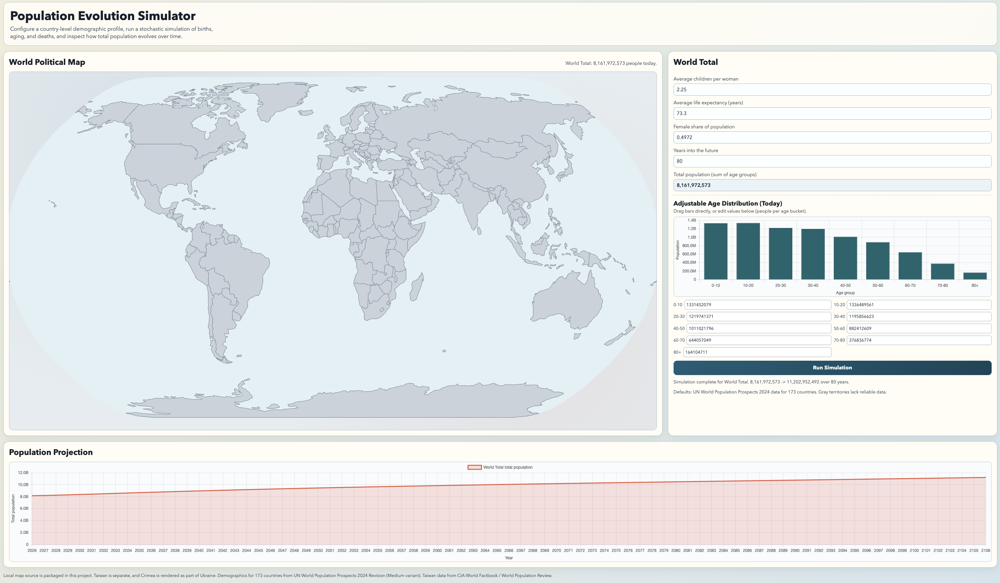

# Population Evolution Simulator

Interactive browser app for country-level population simulations.

## Features

- Clickable world political map as the main entry point.
- Click ocean/background to switch the input panel to `World Total`.
- Per-country input profile:
  - Average children per woman.
  - Average life expectancy.
  - Adjustable age-distribution bar plot (drag bars or edit numeric values).
  - Simulation horizon in years.
- Pre-loaded with default data found on the Internet.
- Stochastic simulation of births, aging, and deaths.
- Output chart of total population over time.

## Run

Everything needed is bundled locally (no runtime internet required). You can:

1. Open `index.html` directly in a browser, or
2. Serve it locally:

```bash
python3 -m http.server 8000
```

Then open [http://localhost:8000](http://localhost:8000).

## Test

Run unit tests for simulation logic:

```bash
npm test
```

## Screenshot



## Notes

- Map boundaries come from `world-atlas` data included under `data/`.
- Startup defaults are preloaded for `World Total` and most countries.
- Data source is World Bank API indicators:
  - `SP.POP.TOTL` (world population, 2024),
  - `SP.DYN.TFRT.IN` (fertility rate, 2023),
  - `SP.DYN.LE00.IN` (life expectancy, 2023),
  - `SP.POP.*` age-band indicators aggregated into 10-year buckets (0-10 ... 70-80, 80+).
  - Source endpoints:
    - `https://api.worldbank.org/v2/country/WLD/indicator/SP.POP.TOTL?format=json`
    - `https://api.worldbank.org/v2/country/WLD/indicator/SP.DYN.TFRT.IN?format=json`
    - `https://api.worldbank.org/v2/country/WLD/indicator/SP.DYN.LE00.IN?format=json`
    - `https://api.worldbank.org/v2/country/USA;CAN;CHN;IND;UKR;RUS;FRA;DEU;ITA;PRT;ESP;MEX;BRA;CHL/indicator/SP.POP.TOTL?format=json`
    - `https://api.worldbank.org/v2/indicator?format=json&per_page=30000` (for age indicator definitions).
- This simulation is intentionally simple and does not model migration, wars, pandemics, policy shocks, or economics.
